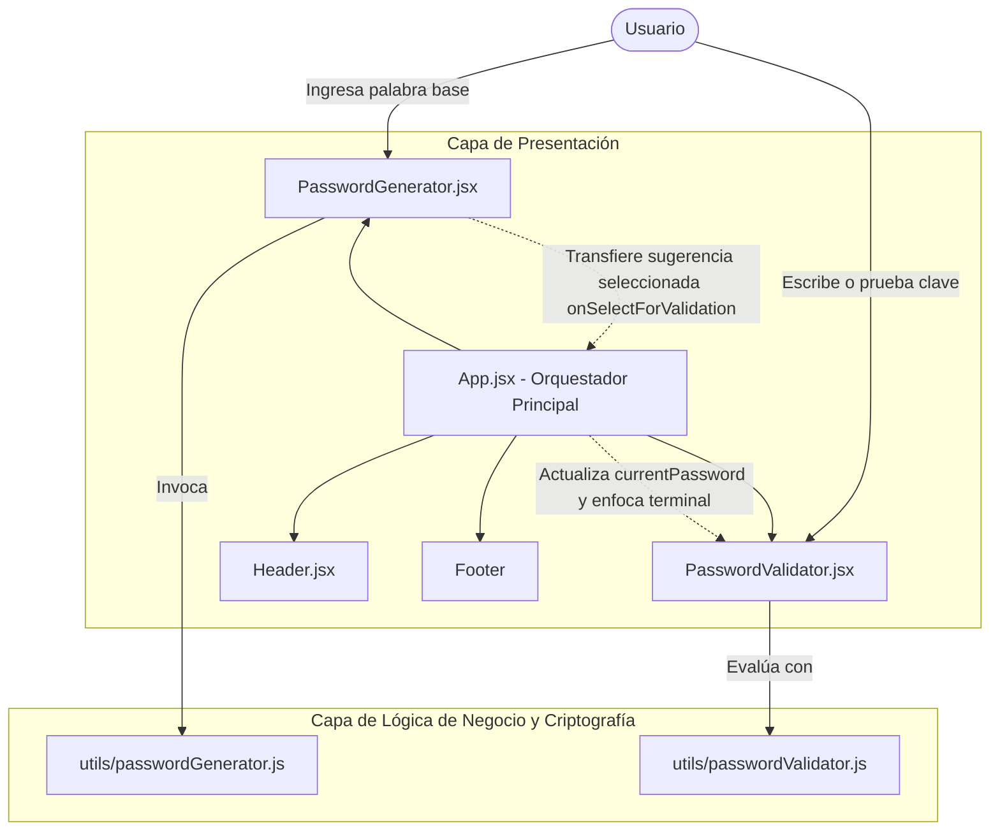
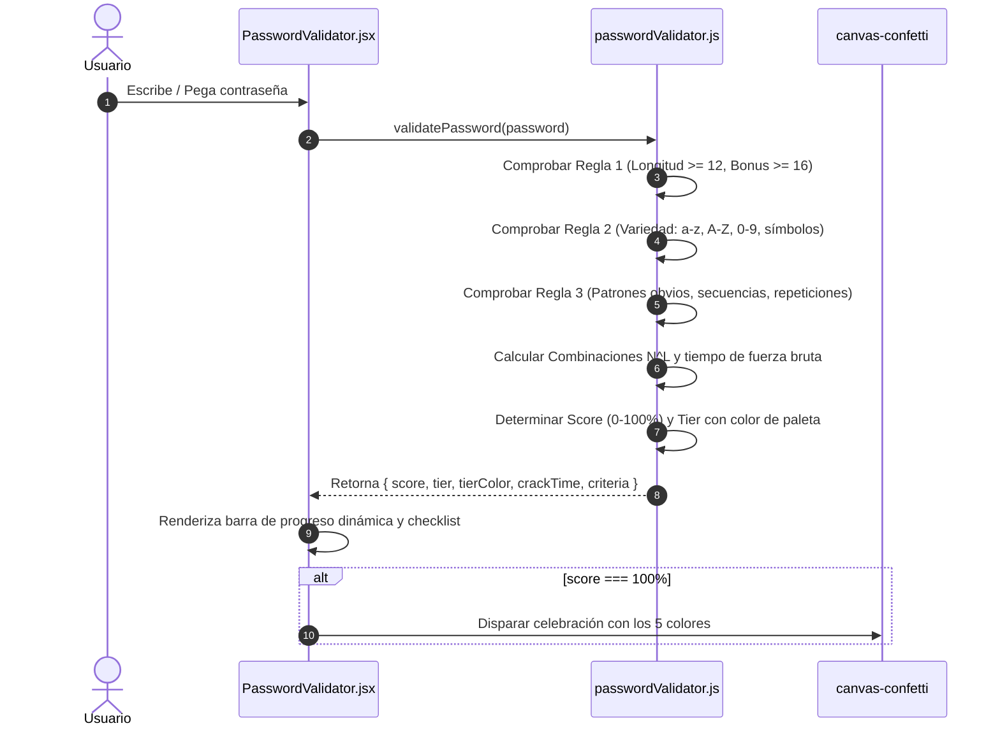
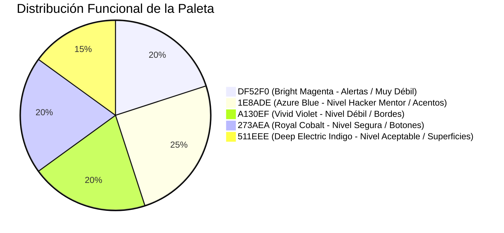

# Documentación Técnica: Validador & Generador de Contraseñas Seguras

**Versión:** 2.0.0  
**Basado en:** *Manual Contraseñas S3guR4$_* — Hacker Mentor  
**Stack:** React 19, Vite 8, Lucide React, Canvas-Confetti, CSS3 Moderno  
**Repositorio:** `/home/yahirfsd/dev/contras`  

---

## 1. Introducción y Propósito del Sistema

El **Validador & Generador de Contraseñas Seguras** es una Single Page Application (SPA) de alta fidelidad técnica y diseño minimalista inspirada directamente en las directrices del **"Manual Contraseñas S3guR4$_"** editado por **Hacker Mentor**.

### Objetivos Clave:
1. **Generación Heurística (Sección 01)**: Transformar palabras comunes o conceptos cotidianos ingresados por el usuario en 3 contraseñas seguras, demostrando empíricamente las técnicas de sustitución leet, frases secretas (passphrases) y tokens criptográficos híbridos.
2. **Auditoría en Tiempo Real (Sección 02)**: Simular una estación de trabajo / computadora de ciberseguridad con terminal interactiva que evalúa en tiempo real cualquier contraseña ingresada contra los 6 parámetros del manual, calculando su resistencia a ataques de fuerza bruta y proyectando el progreso en un dock con gradientes dinámicos.

---

## 2. Arquitectura de Software

La aplicación sigue una arquitectura modular en React desacoplada en:
- **Capa de Lógica Pura / Heurísticas (`src/utils/`)**: Módulos independientes de UI que encapsulan los algoritmos matemáticos y criptográficos.
- **Capa de Componentes de Interfaz (`src/components/`)**: Componentes funcionales reactivos desacoplados con responsabilidades únicas.
- **Capa de Orquestación (`src/App.jsx`)**: Gestión de estado compartido para la transferencia directa de contraseñas desde el generador hacia el validador con animación de scroll suave.

### Diagrama de Componentes y Flujo de Datos



### Diagrama de Secuencia de Validación



---

## 3. Especificación de Algoritmos Criptográficos y de Generación

Ubicación del módulo: `src/utils/passwordGenerator.js`

### 3.1. Técnica 1: Sustitución Leet Dinámica (`generateLeetPassword`)
- **Principio del Manual**: Regla 3 (*"Si quieres usar palabras comunes mezcla y reemplaza letras con mayúsculas, símbolos y números"*) y el ejemplo de la página 11 `T!g3rL!ly#2024!RunS`.
- **Mapeo de Sustitución**:
  $$\text{LEET\_MAP} = \{ a \to [4, @], e \to [3], i \to [1, !], o \to [0], s \to [\$, 5], t \to [7], b \to [8], g \to [9] \}$$
- **Mecanismo**:
  1. Limpia y normaliza el texto alfanumérico.
  2. Sustituye caracteres con probabilidad del 70% o alterna mayúsculas/minúsculas.
  3. Asegura la presencia de minúsculas y mayúsculas.
  4. Agrega un separador especial aleatorio (`!`, `#`, `$`, `@`, `&`), un año o número (`2025`, `2026`, `99`), un símbolo adicional (`*`, `_`, `%`) y un sufijo de alta entropía (`RunS`, `Safe`, `Pro7`, `Lock`).
  5. **Garantía**: Longitud final siempre $\ge 14$ caracteres, conteniendo los 4 grupos de caracteres obligatorios.

### 3.2. Técnica 2: Frase Secreta / Passphrase Mnemotécnica (`generatePassphrasePassword`)
- **Principio del Manual**: Regla 4 (*"Las frases largas y únicas son fáciles de recordar para ti, pero difíciles de adivinar para los atacantes"*) y el ejemplo textual de la página 6 `MisPerros3ComenGalletas!`.
- **Mecanismo**:
  1. Combina un prefijo (`Mis`, `Super`, `Gran`, `Alto`, `ElFuerte`), la palabra base capitalizada, un número natural ($2 \le n \le 9$), un verbo activo (`Comen`, `Saltan`, `Cuidan`, `Vigilan`, `Protegen`, `Blindan`) y un complemento temático (`Galletas`, `Galaxias`, `Secretos`, `Codigos`, `Diamantes`).
  2. Concluye con un carácter de cierre especial (`!`, `#`, `$`, `*`).
  3. **Garantía**: Longitud promedio entre $22$ y $32$ caracteres, con altísima entropía frente a ataques de diccionario.

### 3.3. Técnica 3: Cripto-Híbrida de Máxima Entropía (`generateCryptoHybridPassword`)
- **Principio del Manual**: Reglas 1 y 2 (*"Longitud de al menos 12 caracteres y combinación obligatoria de 4 familias de caracteres"*).
- **Mecanismo**:
  1. Transforma el núcleo de la palabra a formato leet capitalizado.
  2. Genera un token prefijo con símbolo especial + entero de 2 dígitos + guion bajo (ej. `&82_`).
  3. Genera un token sufijo con símbolo aleatorio + 2 letras mayúsculas aleatorias + 2 letras minúsculas aleatorias.
  4. **Garantía**: Entropía criptográfica uniforme, longitud $\ge 14$.

---

## 4. Motor de Validación y Auditoría

Ubicación del módulo: `src/utils/passwordValidator.js`

### 4.1. Criterios de Evaluación Auditados
La función `validatePassword(password)` verifica de forma atómica:

| ID Criterio | Parámetro Auditado | Regla del Manual | Expresión Regular / Lógica |
| :--- | :--- | :--- | :--- |
| `length` | Longitud $\ge 12$ caracteres | Regla 1 | `length >= 12` (Bonus si $\ge 16$) |
| `lower` | Letras minúsculas | Regla 2 | `/[a-z]/.test(pwd)` |
| `upper` | Letras mayúsculas | Regla 2 | `/[A-Z]/.test(pwd)` |
| `number` | Números | Regla 2 | `/[0-9]/.test(pwd)` |
| `symbol` | Símbolos especiales | Regla 2 | `/[^a-zA-Z0-9\s]/.test(pwd)` |
| `noObvious` | Sin palabras comunes / secuencias | Regla 3 | Lista negra (`password`, `123456`, `qwerty`), secuencias `012..789` y repeticiones `(.)\1{2,}` |

### 4.2. Ponderación del Puntaje (0% a 100%)
- **Longitud (máx. 40 pts)**:
  - $\ge 16$ caracteres: 40 pts.
  - $\ge 12$ caracteres: 32 pts.
  - $\ge 8$ caracteres: 18 pts.
  - $< 8$ caracteres: Proporcional lineal $\le 10$ pts.
- **Variedad de Caracteres (máx. 50 pts)**:
  - 12.5 pts por cada familia presente (minúsculas, mayúsculas, dígitos, símbolos).
- **Ausencia de Patrones Obvios (máx. 10 pts / Penalización)**:
  - Si no tiene patrones y longitud $\ge 8$: +10 pts.
  - Si contiene palabras de diccionario o secuencias obvias: **Penalización de -25 pts**.

### 4.3. Modelo Matemático de Fuerza Bruta
Para estimar el tiempo de descifrado, se calcula el espacio de búsqueda combinatorial:
$$C = N^L$$
Donde:
- $L$ = Longitud de la cadena.
- $N$ = Tamaño del conjunto de caracteres posibles según la variedad detectada:
  - Minúsculas: $+26$
  - Mayúsculas: $+26$
  - Números: $+10$
  - Símbolos: $+33$

Se asume una tasa de cómputo de fuerza bruta moderna de alta escala:
$$\text{Hashes por segundo} = 10^{10} \ (10 \text{ mil millones/seg})$$
$$\text{Tiempo (segundos)} = \frac{C}{10^{10}}$$

Los resultados se formatean en lenguaje humano:
- $< 1\text{ s}$: *Menos de 1 segundo (Instantáneo)*
- $< 60\text{ s}$: *$N$ segundos*
- $< 3600\text{ s}$: *$N$ minutos*
- $< 86400\text{ s}$: *$N$ horas*
- $< 31536000\text{ s}$: *$N$ días*
- Hasta *Millones de años* o *Trillones de siglos*.

---

## 5. Sistema de Diseño e Identidad Visual

### 5.1. Paleta de Colores
La interfaz está construida con la siguiente paleta cromática:



| Código Hex | Denominación | Uso en el Sistema | Variable CSS |
| :--- | :--- | :--- | :--- |
| **`#DF52F0`** | Bright Magenta | Estado "Muy Débil", indicador pendiente, acentos de alerta | `--c-magenta` |
| **`#1E8ADE`** | Electric Azure Blue | "Nivel Hacker Mentor", checks aprobados, botón activo | `--c-azure` |
| **`#A130EF`** | Vivid Violet | Estado "Débil", bordes sutiles, tags de reglas | `--c-purple` |
| **`#273AEA`** | Royal Cobalt Blue | Estado "Segura", degradados de botones | `--c-cobalt` |
| **`#511EEE`** | Deep Electric Indigo | Estado "Aceptable", superficie de cards y dock | `--c-indigo` |

### 5.2. Metáfora Visual de la Computadora Workstation
La **Sección 02** simula un monitor de seguridad completo:
1. **Chasis y Bisel**: Monitor con bordes en aluminio oscuro obsidiana (`#141224`), borde perimetral en `rgba(161, 48, 239, 0.35)` y cámara web central con LED de encendido en `#1E8ADE`.
2. **Pantalla Terminal (Security OS)**: Fondo `#0A0916`, barra de título con controles de ventana traffic-lights (`#DF52F0`, `#A130EF`, `#1E8ADE`), comando `auditor@hacker-mentor:~/validador$ evaluar-clave`.
3. **Dock Inferior**: Barra de control alojada en la base de la pantalla con medidor de score, insignia de estado y barra de progreso con gradiente dinámico sincronizado.
4. **Soporte Físico**: Cuello y base de escritorio minimalista (`stand-neck` y `stand-base`) con proyección de sombra realista.

---

## 6. Estructura de Directorios del Código Fuente

```text
/home/yahirfsd/dev/contras/
├── index.html                     # Entrada HTML con metadatos y fuentes
├── package.json                   # Dependencias y scripts npm/pnpm
├── vite.config.js                 # Configuración de empaquetado Vite
├── .oxlintrc.json                 # Configuración del linter Oxlint
├── DOCUMENTACION_TECNICA.md       # Documento técnico en el repositorio
├── src/
│   ├── main.jsx                   # Punto de entrada de React 19
│   ├── App.jsx                    # Componente raíz y orquestación
│   ├── App.css                    # Estilos CSS de la computadora y componentes
│   ├── index.css                  # Variables de diseño, fuentes y reset
│   ├── components/
│   │   ├── Header.jsx             # Encabezado institucional con navegación
│   │   ├── PasswordGenerator.jsx  # Sección 01: Generador heurístico
│   │   └── PasswordValidator.jsx  # Sección 02: Workstation y dock dinámico
│   └── utils/
│       ├── passwordGenerator.js   # Algoritmos Leet, Passphrase y Cripto-Híbrido
│       └── passwordValidator.js   # Motor de cálculo, 6 criterios y fuerza bruta
```

---

## 7. Guía de Ejecución, Compilación y Mantenimiento

### 7.1. Requisitos Previos
- **Node.js**: $\ge 18.0.0$ (Probado en Node.js v24)
- **Gestor de Paquetes**: `pnpm` $\ge 9$ (o `npm`)

### 7.2. Scripts Disponibles

```bash
# Navegar al directorio del proyecto
cd /home/yahirfsd/dev/contras

# Instalar dependencias
pnpm install

# Iniciar servidor de desarrollo en caliente (HMR)
pnpm run dev
# URL local típica: http://localhost:5173/

# Ejecutar análisis estático de código (Linter)
pnpm run lint

# Generar compilación optimizada para producción
pnpm run build

# Previsualizar el paquete compilado en dist/
pnpm run preview
```

---

## 8. Matriz de Pruebas y Validación de Calidad

| Caso de Prueba | Entrada | Salida Esperada | Resultado Real | Estado |
| :--- | :--- | :--- | :--- | :--- |
| **Ejemplo Manual Pág. 6** | `MisPerros3ComenGalletas!` | 100%, Nivel Hacker Mentor, Trillones de siglos | Score: 100, Tier: Nivel Hacker Mentor, CrackTime: Trillones de siglos | **PASÓ** |
| **Ejemplo Manual Pág. 11** | `T!g3rL!ly#2024!RunS` | 100%, Nivel Hacker Mentor, Trillones de siglos | Score: 100, Tier: Nivel Hacker Mentor, CrackTime: Trillones de siglos | **PASÓ** |
| **Patrón Inseguro Pág. 5** | `123456` | < 20%, Muy Débil, Instantáneo | Score: 10, Tier: Muy Débil, CrackTime: < 1 seg | **PASÓ** |
| **Palabra Común Pág. 5** | `password123` | < 25%, Muy Débil, Penalización aplicada | Score: 18, Tier: Muy Débil, CrackTime: 152 días | **PASÓ** |
| **Generador: Palabra 'perro'** | "perro" | 3 sugerencias, longitud $\ge 14$, 4 familias de caracteres | 3 variantes generadas, todas score $\ge 92$ | **PASÓ** |
| **Transferencia entre secciones** | Clic en "Probar en Validador" | Clave cargada en pantalla de computadora y scroll suave | Clave reflejada en input terminal, scroll fluido ejecutado | **PASÓ** |
| **Análisis Estático (Lint)** | `oxlint` | 0 errores, 0 advertencias | 0 warnings, 0 errors (8 files) | **PASÓ** |
| **Compilación Vite (Build)** | `vite build` | Salida limpia en `dist/` | Generado en ~600ms sin errores | **PASÓ** |
